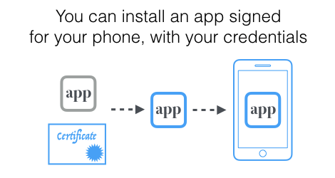
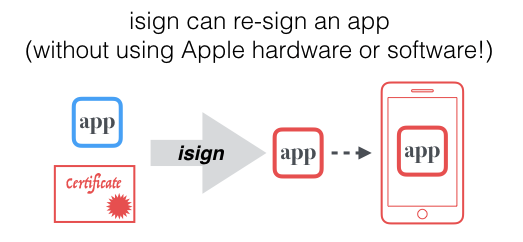

### 超级签系统实现细节

iOS超级签系统

整体流程

#### 1.发布app
Jenkins拉去Git源码，在master分支构建app <br>


并可以实时看到打包日志<br>


上传APP到自己的服务器<br>



#### 2.用户(新设备)在推广页面扫码下载App

新设备无法安装，点击安装遇到问题去获取UDID<br>



需要先获取设备UDID，然后把UDID注册到苹果开发者账号设备列表中，然后重新生成证书

如何获取UDID？
苹果公司允许开发者通过IOS设备和Web服务器之间的某个操作，来获得IOS设备的UDID(包括其他的一些参数)。这里的一个概述：
1.	创建一个udid.mobileconfig的plist格式的描述文件，放在你的web服务器上
2.	用户在Safari浏览器中下载并安装udid.mobileconfig描述文件
3.	安装完成后会发送数据（UDID、IMEI等）到指定的服务器
4.	服务端收到UDID信息后回显到html页面中，用户复制UDID给到开发人员加入设备列表中
5.	后端Spring Boot微服务获取苹果发送的udid信息

未签名的udid.mobileconfig
```xml
<?xml version="1.0" encoding="UTF-8"?>
<!DOCTYPE plist PUBLIC "-//Apple//DTD PLIST 1.0//EN" "http://www.apple.com/DTDs/PropertyList-1.0.dtd">
<plist version="1.0">
<dict>
	<key>PayloadContent</key>
	<dict>
		<key>URL</key>
		<string>https://ios.ystata.xyz/app/udid</string>
		<key>DeviceAttributes</key>
		<array>
			<string>UDID</string>
			<string>IMEI</string>
			<string>ICCID</string>
			<string>VERSION</string>
			<string>PRODUCT</string>
		</array>
	</dict>
	<key>PayloadOrganization</key>
	<string>www.fanshow.top</string>
	<key>PayloadDisplayName</key>
	<string>UDID助手</string>
	<key>PayloadVersion</key>
	<integer>1</integer>
	<key>PayloadUUID</key>
	<string>8C7AD0B8-3900-44DF-A52F-3C4F94231807</string>
	<key>PayloadIdentifier</key>
	<string>com.udid.profile-service</string>
	<key>PayloadDescription</key>
	<string>该配置文件将帮助用户获取当前iOS设备的UDID号码。This temporary profile will be used to find and display your current device&apos;s UDID.</string>
	<key>PayloadType</key>
	<string>Profile Service</string>
</dict>
</plist>
```


https://ios.ystata.xyz/app/udid <br>

这个就是苹果回调的UDID接口地址<br>


用服务器域名证书ssl签名udid.mobileconfig<br>

- unsigned.mobileconfig 证书描述文件
- server.crt 服务器证书certificate fanshow-top-certificate.crt
- server.key 服务器私钥private key fanshow-top-private.key
- cert-chain.crt 颁发服务器证书的CA机构的证书，https认证就是让CA机构证明你的域名是安全的 fanshow-top-ca_bundle.crt
- signed.mobileconfig 签名之后的描述文件

如果上面的文件你都有，则执行下面命令进行签名<br>

```shell
openssl smime -sign -in unsigned.mobileconfig -out signed.mobileconfig -signer server.crt -inkey server.key -certfile cert-chain.crt -outform der -nodetach
```

把签名的证书放到web服务器中，我的web服务器是SpringBoot+Thymeleaf架构，直接将文件放到resources/static下即可访问到。你也可以直接放到阿里云文件服务器上或nginx服务器根目录中。



用户在Safari浏览器中下载并安装udid.mobileconfig描述文件 <br>
Safari访问 https://ios.ystata.xyz/app/udid.mobileconfig 安装配置文件<br>

```java

@Controller
public class AppUDIDController {

    private final Logger logger = LoggerFactory.getLogger(AppUDIDController.class);

    @RequestMapping("/udid")
    public ModelAndView getUDID(HttpServletRequest request, HttpServletResponse response) {
        UDIDEntity entity = new UDIDEntity();
        try {
            // 类型是 application/pkcs7-signature 签名的信息
            logger.info(request.getContentType());

            // 获取输入流
            InputStream stream = request.getInputStream();
            byte[] buffer = new byte[512];
            StringBuilder builder = new StringBuilder();
            while (stream.read(buffer) != -1) {
                builder.append(new String(buffer));
            }
            // 输入流的字符串
            String string = builder.toString();
            // 获取plist
            String plistString = string.substring(string.indexOf("<?xml"), string.indexOf("</plist>") + 8);
            logger.info(plistString);
            // 用google的dd-plist解析plist格式文件
            NSDictionary rootDict = (NSDictionary)PropertyListParser.parse(plistString.getBytes());
            logger.info(rootDict.toString());
            // 将获取到的内容绑定实体
            if (rootDict.containsKey("IMEI")) {
                entity.setIMEI(rootDict.get("IMEI").toString());
            }
            if (rootDict.containsKey("PRODUCT")) {
                entity.setPRODUCT(rootDict.get("PRODUCT").toString());
            }
            if (rootDict.containsKey("UDID")) {
                entity.setUDID(rootDict.get("UDID").toString());
            }
            if (rootDict.containsKey("VERSION")) {
                entity.setVERSION(rootDict.get("VERSION").toString());
            }
            logger.info(entity.toString());

        } catch (Exception e) {
            logger.info("plist解析失败");
            e.printStackTrace();
        }
        // 301之后iOS设备会自动打开safari浏览器，不设置会导致app安装描述文件失败
        RedirectView redirectView = new RedirectView("udid.html");
        redirectView.setAttributesMap(entity.toMap());
        redirectView.setStatusCode(HttpStatus.MOVED_PERMANENTLY);
        return new ModelAndView(redirectView);
    }

}

```

把UDID保存起来，下次就不用再去获取用户UDID了<br>


#### 3. 重签IPA(在linux上resign ipa)





https://github.com/sauce-archives/isign


---

从p12中获取cert.pem, key.pem, sign.mobileprovision

```shell
$ isign_export_creds.sh ~/Certificates.p12

$ ls -l ~/.isign
-r--r--r--    1 alice  staff  2377 Sep  4 14:17 certificate.pem
-r--r--r--    1 alice  staff  9770 Nov 23 13:30 isign.mobileprovision
-r--------    1 alice  staff  1846 Sep  4 14:17 key.pem

```


然后就可以重签了<br>

```shell
isign -o resigned.ipa my.ipa
```


把重签的ipa放到新的目录中，并生成plist，用户点击安装通过Safari安装plist来下载ipa的 <br>

```xml
<?xml version="1.0" encoding="UTF-8"?>
<!DOCTYPE plist PUBLIC "-//Apple//DTD PLIST 1.0//EN" "http://www.apple.com/DTDs/PropertyList-1.0.dtd">
<plist version="1.0">
<dict>
	<key>items</key>
	<array>
		<dict>
			<key>assets</key>
			<array>
				<dict>
					<key>kind</key>
					<string>software-package</string>
					<key>url</key>
					<string>http://172.16.109.13:8090/download/ios/ymsport/20210415080901/ymsport.ipa</string>
				</dict>
				<dict>
					<key>kind</key>
					<string>full-size-image</string>
					<key>url</key>
					<string>http://172.16.109.13:8090/download/ios/icon-512.png</string>
				</dict>
			</array>
			<key>metadata</key>
			<dict>
				<key>bundle-identifier</key>
				<string>com.kok.ymsport</string>
				<key>bundle-version</key>
				<string>1.0.0</string>
				<key>kind</key>
				<string>software</string>
				<key>platform-identifier</key>
				<string>com.apple.platform.iphoneos</string>
				<key>title</key>
				<string>ymsport.ipa</string>
			</dict>
		</dict>
	</array>
</dict>
</plist>
```


#### 4. 检查证书是否掉签


把cert.p12证书文件转换成pem <br>
```shell
openssl pkcs12 -in cert.p12 -nokeys -out cert.pem -nodes
```

查看pem证书内容，目的是找出CA Issuers和OCSP url<br>
```shell
openssl x509 -noout -text -in cert.pem

Authority Information Access:
CA Issuers - URI:http://certs.apple.com/wwdrg3.der
OCSP - URI:http://ocsp.apple.com/ocsp03-wwdrg304

```


下载CA Issuers wwdrg3.der证书<br>
```shell
curl http://certs.apple.com/wwdrg3.der >> wwdrg3.der
```
转换der为pem<br>
```shell
openssl x509 -in wwdrg3.der -inform der -outform pem -out wwdrg3.pem
```

wwdrg3.der是上一级颁发的证书，用他来验证他下面的证书是否有效（最好是需要级联验证直到跟证书）<br>
```shell
openssl ocsp -issuer wwdrg3.pem -cert cert.pem -text -url http://ocsp.apple.com/ocsp03-wwdrg304 -header host ocsp.apple.com
```

```shell
OCSP Request Data:
    Version: 1 (0x0)
    Requestor List:
        Certificate ID:
          Hash Algorithm: sha1
          Issuer Name Hash: A50547C08947C3C78B275AE8AE5EFD0B41853AE0
          Issuer Key Hash: 09FEC01590F9AF640A9212B92628630C97ECA7B2
          Serial Number: 0F1F64A07D5CFD86829584CF7F40EBAC
    Request Extensions:
        OCSP Nonce: 
            0410A70989BCDA396530A9262039FC21DBD1
OCSP Response Data:
    OCSP Response Status: successful (0x0)
    Response Type: Basic OCSP Response
    Version: 1 (0x0)
    Responder Id: FD8314D9E5F9799CD5F4CAE672636030E47264E6
    Produced At: Apr 15 05:52:17 2021 GMT
    Responses:
    Certificate ID:
      Hash Algorithm: sha1
      Issuer Name Hash: A50547C08947C3C78B275AE8AE5EFD0B41853AE0
      Issuer Key Hash: 09FEC01590F9AF640A9212B92628630C97ECA7B2
      Serial Number: 0F1F64A07D5CFD86829584CF7F40EBAC
    Cert Status: good
    This Update: Apr 15 05:52:17 2021 GMT
    Next Update: Apr 15 17:52:17 2021 GMT

```









#### 新思路获取UDID


---

IPA签名过程

1、登入苹果开发者账号
- p8(私钥)认证（Api key）
  •	No 2FA needed
  •	Better performance
  •	Documented API
  •	Increased reliability

- 用户名密码认证（Apple ID）
  正常开发者使用意味着永远不会失效


2、添加设备UDID

3、生成profile（bundleID+UDID+cert）

4、用profile给ipa重签（p12+profile）


云雀2.0版本优化内容：
1 调用FASTLANE签名，签名从云雀移到打包机
2 多点部署（ios CND预热）例如柬埔寨的用户可以去越南，下载迅速
3 支持多个打包机，负载
4 云雀系统操作流程优化


调用FASTLANE签名，签名从云雀移到打包机
1、用户扫码获取UDID后回调云雀后台，云雀发送UDID给打包机
2、UDID按格式写入devices.txt文件中，需要做预警判断，例如90预警写入下一个devices.txt
- 一个devices.txt对应一个开发者账号且固定
  3、调用fastlane match为刚才UDID生成pv，存储到git/mino后面直接从本地读（大约15S）
- p8认证
- AppleID认证
- 两种方式切换，如果p8接口报5xx错误就切换AppleID认证
- 来了一个新设备，开一个线程去调用fastlane match
- 多台打包机集群部署，通过git保证所有机器证书是一致的
  4、用生成的pv给ipa签名
- 解压原包把UDID和渠道channelCode写入ipa里的Info.plist中
- 根据PV/或生成p12调用fastlane sigh resign重新签名
  5、把ipa传到CND，落地页回调前端页面，result通知云雀
  6、定时检测证书是否掉签


